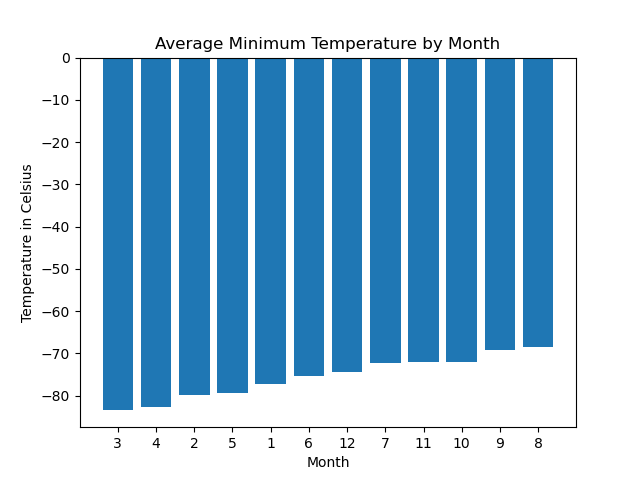

# mars-news

## Table of Contents
- [Project Description](#project-description)
- [Analysis](#analysis)
- [Acknowledgements](#acknowledgements)

## Project Description
### Part 1:
- Part 1 of this project uses BeautifulSoup to scrape the Mars news site and loop through the articles to print a list of the titles and article previews.

### Part 2:
- Part 2 of this project is designed to scrape and analyze data from the Mars Temperature Data site, return charts to help visualize the data and create csv of the data collected.

## Analysis
### How many months exist on Mars?
- **12** months exist on mars.

### How many Martian (and not Earth) days worth of data exist in the scraped dataset?
- **1867** Martian days worth of data exists in the scraped dataset.

### Average Minimum Temperature by Month

---

### Average Minimum Temperature by Month Sorted

What are the coldest and the warmest months on Mars (at the location of Curiosity)? 
- *Coldest: Month 3 is the coldest month.*
- *Warmest: Month 8 is the warmest month.*
---

### Average Pressure by Month

---

### Average Pressure by Month Sorted

Which months have the lowest and the highest atmospheric pressure on Mars?
- *Lowest: Month 6 has the lowest atmospheric pressure on Mars.*
- *Highest: Month 9 has the highest atmospheric pressure.*
---

### Minimum Temperature over Time

## Acknowledgements
**Data Sources**: 
- https://static.bc-edx.com/data/web/mars_news/index.html 
- https://static.bc-edx.com/data/web/mars_facts/temperature.html